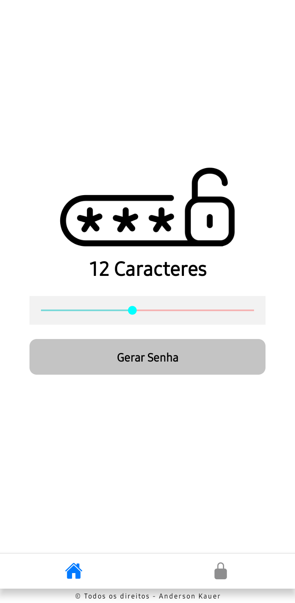
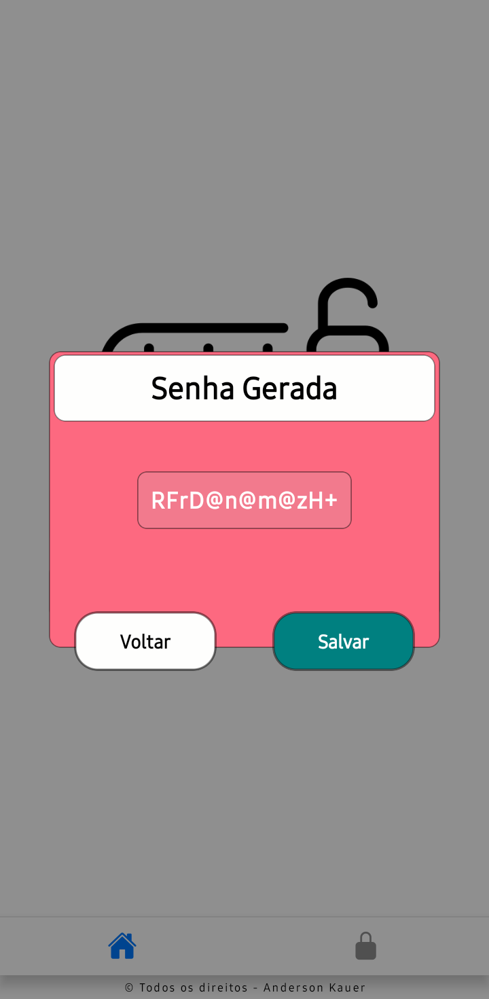
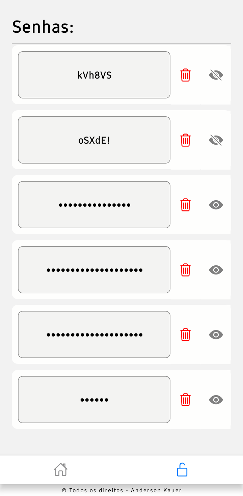
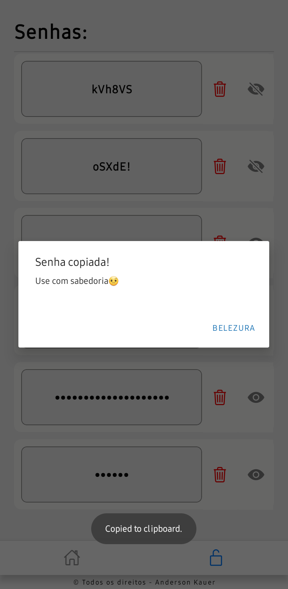

# Projeto de Geração de Senhas Aleatórias com React Native - AsyncStorage

## Descrição

Este projeto consiste em um aplicativo desenvolvido utilizando React Native, com o propósito de gerar senhas aleatórias e armazená-las no dispositivo móvel. A persistência de dados é realizada através do AsyncStorage, proporcionando ao usuário a capacidade de criar, visualizar e excluir senhas de forma segura.

## Funcionalidades

1. **Geração de Senhas Aleatórias:**

   - O aplicativo permite a geração de senhas aleatórias com diferentes níveis de complexidade (por exemplo, números, letras maiúsculas, letras minúsculas e caracteres especiais).
   - Minimo 6 caractere e maximo 20

2. **Armazenamento Local:**

   - As senhas geradas são salvas no dispositivo utilizando o AsyncStorage, garantindo a persistência dos dados mesmo após o fechamento do aplicativo.

3. **Visualização Segura:**

   - As senhas são exibidas de forma oculta por padrão, proporcionando uma camada adicional de segurança ao usuário.

4. **Exclusão de Senhas:**
   - O usuário tem a capacidade de excluir senhas salvas, fornecendo uma experiência personalizável e gerenciável.

## Tecnologias Utilizadas

- **React Native:**

  - Utilizado para o desenvolvimento da interface de usuário e lógica do aplicativo.

- **AsyncStorage:**
  - Empregado para armazenar localmente as senhas geradas pelo aplicativo.

## Instruções de Uso

1. **Geração de Senhas:**

   - Na tela principal, o usuário pode gerar senhas aleatórias pressionando o botão correspondente.

2. **Visualização e Exclusão de Senhas:**

   - A tela de visualização exibe todas as senhas geradas, permitindo ao usuário visualizá-las e deletar aquelas que não são mais necessárias.

3. **Segurança na Visualização:**

   - As senhas são exibidas de forma oculta por padrão. Ao tocar na senha, o usuário pode visualizá-la claramente.

4. **Exclusão de Senhas:**
   - Para excluir uma senha, o usuário pode selecionar a opção de exclusão.

## Conclusão

Este projeto proporciona uma solução simples e eficaz para a geração e gerenciamento de senhas aleatórias, oferecendo ao usuário controle sobre suas credenciais de forma intuitiva e segura. O uso do AsyncStorage permite uma experiência contínua, mesmo em situações offline.
